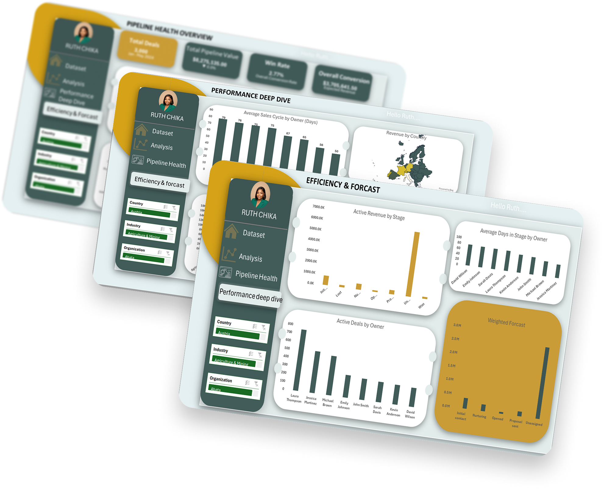

# CRM Sales Pipeline Analysis — Excel Dashboard Project

**Tools Used:** Microsoft Excel | Power Pivot | DAX | Pivot Tables | Data Visualization  
**Dataset:** 3,000 CRM deal records across 9 European countries  
**Project Type:** Unguided Portfolio Project | End-to-End Analysis  

---

## Project Overview

This project involved a full end-to-end analysis of a CRM sales pipeline dataset containing 3,000 deal records. Starting from raw data, I performed data cleaning, created derived columns, built a data model using Power Pivot, wrote DAX measures, and designed three interactive dashboards to surface key business insights.

The goal was to answer one central question: **What does this pipeline actually tell us about the health of this sales team?**

---

## The Dataset

| Field | Description |
|---|---|
| Organization | Company name |
| Country | 9 European countries |
| Industry | 15 industry categories |
| Organization Size | Micro, Small, Medium, Large, Enterprise |
| Owner | 8 sales reps |
| Lead Acquisition Date | When the deal entered the pipeline |
| Stage | Current deal stage (Won, Lost, Proposal Sent, etc.) |
| Deal Value $ | Total deal value |
| Probability % | Estimated close probability |
| Expected Close Date | Projected close date |

---

## Data Cleaning & Preparation

- Identified **1,039 records (34.6%) with blank Stage** — labeled as "Unassigned" using a derived column to preserve data integrity without deleting records
- Created **Sales Cycle Days** using DATEDIF between Lead Acquisition Date and Expected Close Date (filtered to Won deals only)
- Created **Forecast Value** = Deal Value × Probability %
- Created **Conversion Flag** = 1 for Won, 0 for Lost (blank for open deals)
- Created **Deal Age** for open deals = TODAY() − Lead Acquisition Date
- Created **Acquisition Month-Year** and **Acquisition Year** for time intelligence

---

## Data Model & DAX Measures

Built a Power Pivot data model with a Calendar table linked to Lead Acquisition Date for time intelligence.

**Key DAX Measures Written:**

```
Total Revenue := SUM(Table1[Deal Value, $])
Win Rate := DIVIDE(COUNTROWS(FILTER(Table1, Table1[Stage]="Won")), COUNTA(Table1[Organization]))
Weighted Forecast := SUMX(Table1, Table1[Deal Value, $] * Table1[Probability, %] / 100)
Avg Sales Cycle := CALCULATE(AVERAGE(Table1[Sales Cycle Days]), Table1[Stage]="Won", Table1[Sales Cycle Days]>0)
MoM Trend := VAR CurrentRevenue = SUM(Table1[Deal Value, $])
             VAR PrevRevenue = CALCULATE(SUM(Table1[Deal Value, $]), PREVIOUSMONTH('Calendar'[Date]))
             VAR ChangePct = DIVIDE(CurrentRevenue - PrevRevenue, PrevRevenue)
             RETURN IF(ISBLANK(PrevRevenue), "No Prior Month", IF(ChangePct > 0, "▲ " & FORMAT(ChangePct,"0.0%"), "▼ " & FORMAT(ABS(ChangePct),"0.0%")))
```

---

## The Dashboards

### Dashboard 1 — Pipeline Health Overview
Answers: *What does our overall pipeline look like?*

- **Total Deals:** 3,000
- **Total Pipeline Value:** $8,275,135
- **Win Rate:** 2.77%
- **Weighted Forecast:** $3,705,641

Key charts: Monthly Revenue Trend | Pipeline by Stage | Revenue by Industry  
Interactive slicers: Country | Industry | Organization Size

---

### Dashboard 2 — Performance Deep Dive
Answers: *Who is performing and where is the money?*

- Laura Thompson manages **25% of the entire pipeline ($2M)** — potential single point of failure
- John Smith has the **highest win rate at 5.02%**
- Italy leads European revenue at **$1.7M**; Belgium has the highest win rate at **5.31%**
- Enterprise deals average **$11,771** vs Micro deals at **$706** — a 16x difference

Key charts: Revenue by Owner | Avg Deal Value by Industry & Org Size | Revenue by Country (filled map) | Avg Sales Cycle by Owner

---

### Dashboard 3 — Efficiency & Forecast
Answers: *How efficient is the pipeline and where is future revenue expected?*

- **2,133 out of 3,000 deals are Unassigned** — $5.97M in untracked pipeline
- Average sales cycle for Won deals: **67 days**
- Education & Science takes the longest to close: **119 days**
- Recreation & Sports closes fastest: **12 days**

Key charts: Active Revenue by Stage | Weighted Forecast by Stage | Active Deals by Owner | Avg Days in Stage by Owner

---

## Key Business Insights

1. **CRM hygiene is a critical issue.** 71% of the pipeline ($5.97M) has no stage assigned, making it impossible to forecast accurately or manage effectively. The immediate fix is making stage assignment mandatory in the CRM.

2. **The win rate of 2.77% is dangerously low.** For every 100 deals pursued, 97 go nowhere. The team needs a sharper qualification framework to focus on deals with a higher probability of closing.

3. **Pipeline concentration is a risk.** Laura Thompson manages 25% of all deals. If she leaves or becomes unavailable, a quarter of the pipeline is at risk.

4. **Industry mix matters.** Entertainment & Media has a 5.74% win rate while Education & Science sits at 0.71% — a 5x gap. The team should allocate more effort to higher-converting industries.

5. **Belgium punches above its weight.** Despite not being the largest market, Belgium has the highest win rate at 5.31%. This market deserves more investment.

---

## Challenges & Learnings

- **FORMAT() in DAX returns text** — charts cannot plot formatted measures. I learned to keep chart measures unformatted and apply number formatting directly on chart axes instead.
- **Won deals had no Actual Close Date** in the dataset — I used Expected Close Date as a proxy for sales cycle calculations, which I documented clearly in the analysis.
- **PivotCharts have formatting limitations** — I switched to regular charts built from clean pivot data to get full control over design and formatting.
- **Data integrity vs. data cleaning** — Instead of deleting blank stage records, I flagged them as "Unassigned" to preserve the full picture and surface the CRM hygiene problem.

---

## Files in This Repository

| File | Description |
|---|---|
| `CRM_Sales_Pipeline_Analysis.xlsx` | Full Excel workbook with raw data, pivot tables, DAX measures and all 3 dashboards |
| `README.md` | Project documentation |

---

## About This Project

This is Project 2 of my **120-Day Data Analytics Portfolio Challenge** — a building-in-public initiative where I document my journey from career switcher to data analyst.

Follow my journey on [LinkedIn](www.linkedin.com/in/ruth-chika) and [X/Twitter](https://x.com/RuthChika12).

---

*Built by Ruth Chika | Data Analyst in Training*
